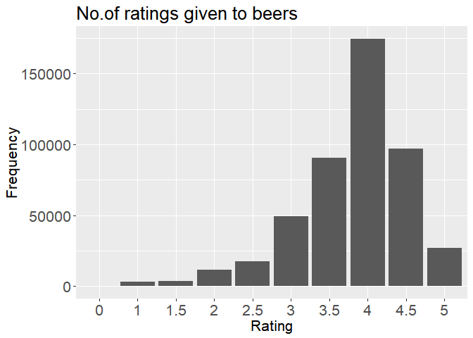
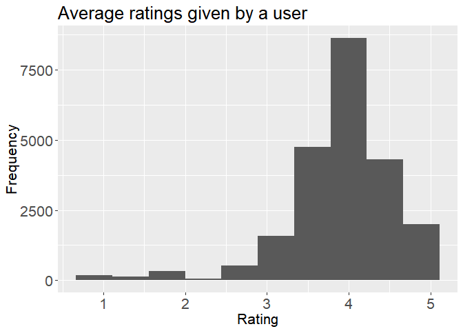
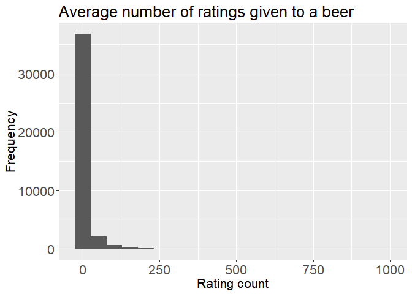
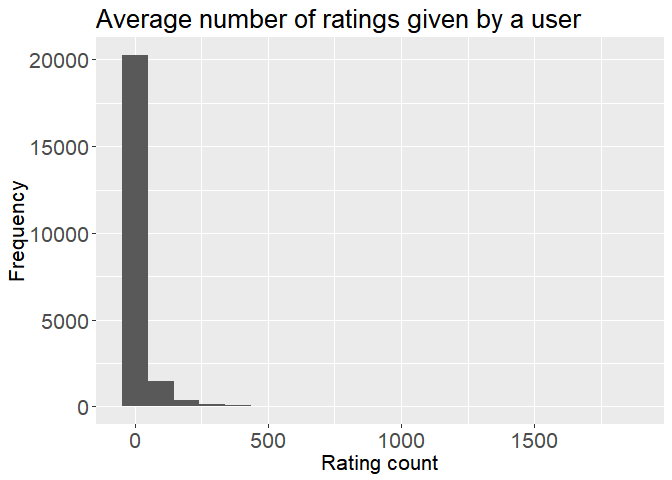
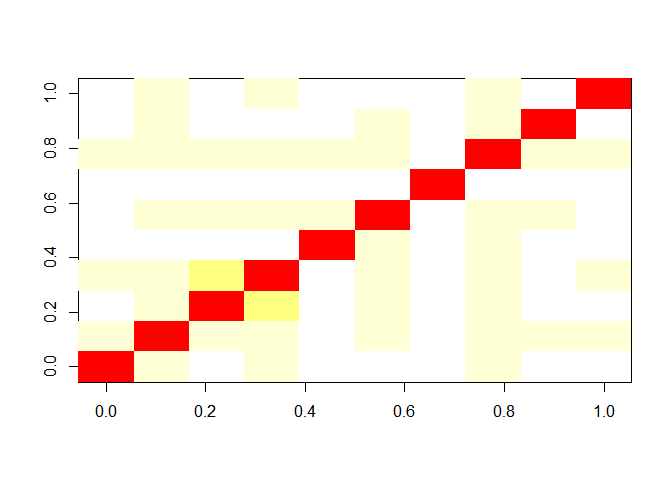
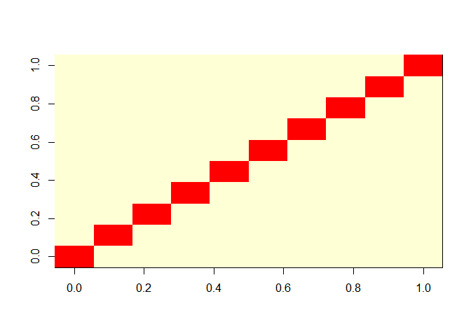
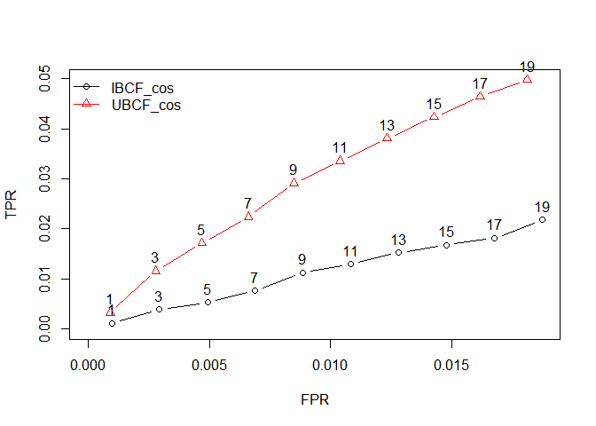
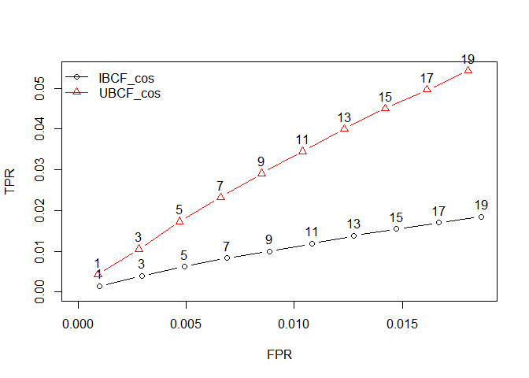

Reccomendation Engine
================
Goldston Dias
March 4, 2019

``` r
#Installing Packages
    library(dplyr)
```

    ## Warning: package 'dplyr' was built under R version 3.5.2

    ## 
    ## Attaching package: 'dplyr'

    ## The following objects are masked from 'package:stats':
    ## 
    ##     filter, lag

    ## The following objects are masked from 'package:base':
    ## 
    ##     intersect, setdiff, setequal, union

``` r
    library(data.table)
```

    ## Warning: package 'data.table' was built under R version 3.5.2

    ## 
    ## Attaching package: 'data.table'

    ## The following objects are masked from 'package:dplyr':
    ## 
    ##     between, first, last

``` r
    library(ggplot2)
    library(recommenderlab)
```

    ## Warning: package 'recommenderlab' was built under R version 3.5.2

    ## Loading required package: Matrix

    ## Warning: package 'Matrix' was built under R version 3.5.2

    ## Loading required package: arules

    ## Warning: package 'arules' was built under R version 3.5.2

    ## 
    ## Attaching package: 'arules'

    ## The following object is masked from 'package:dplyr':
    ## 
    ##     recode

    ## The following objects are masked from 'package:base':
    ## 
    ##     abbreviate, write

    ## Loading required package: proxy

    ## Warning: package 'proxy' was built under R version 3.5.2

    ## 
    ## Attaching package: 'proxy'

    ## The following object is masked from 'package:Matrix':
    ## 
    ##     as.matrix

    ## The following objects are masked from 'package:stats':
    ## 
    ##     as.dist, dist

    ## The following object is masked from 'package:base':
    ## 
    ##     as.matrix

    ## Loading required package: registry

    ## Warning: package 'registry' was built under R version 3.5.2

``` r
    library(reshape2)
```

    ## Warning: package 'reshape2' was built under R version 3.5.2

    ## 
    ## Attaching package: 'reshape2'

    ## The following objects are masked from 'package:data.table':
    ## 
    ##     dcast, melt

``` r
    library(Matrix)
```

1)Reading Dataset
=================

``` r
#Importing datasets
beer_data <- read.csv('beer_data.csv',na.strings = "")
View(beer_data)
```

### Checking for duplicates

``` r
beer_data <- unique(beer_data)
print(dim(beer_data))
```

    ## [1] 475404      3

### Print summary

``` r
summary(beer_data)
```

    ##   beer_beerid         review_profilename review_overall 
    ##  Min.   :    3   northyorksammy:  1844   Min.   :0.000  
    ##  1st Qu.: 1716   mikesgroove   :  1377   1st Qu.:3.500  
    ##  Median :13896   BuckeyeNation :  1337   Median :4.000  
    ##  Mean   :21663   Thorpe429     :  1072   Mean   :3.814  
    ##  3rd Qu.:39397   ChainGangGuy  :  1046   3rd Qu.:4.500  
    ##  Max.   :77317   (Other)       :468628   Max.   :5.000  
    ##                  NA's          :   100

2) Exploration-
===============

### How are ratings distributed?

``` r
ggplot(data = beer_data, aes(x = factor(review_overall))) + 
  geom_bar() +
  labs(title="No.of ratings given to beers", x="Rating", y="Frequency") +
  theme(text = element_text(size=16),axis.text = element_text(size=16))
```



### Distribution of Average rating by user?

``` r
x <- beer_data %>%
  group_by(review_profilename) %>%
  summarise(ratings_mean = mean(review_overall))
##How are rating distributed
ggplot(data = x, aes(x = ratings_mean)) + 
  geom_histogram(bins = 10) +
  labs(title="Average ratings given by a user", x="Rating", y="Frequency") +
  theme(text = element_text(size=16),axis.text = element_text(size=16))
```



Most people rate beer highly.

### Distribution of nummber of rating given to a beer?

``` r
beer_wise_count <- beer_data %>%
  group_by(beer_beerid) %>%
  summarise(rating_count = length(review_overall))

summary(beer_wise_count)
```

    ##   beer_beerid     rating_count   
    ##  Min.   :    3   Min.   :  1.00  
    ##  1st Qu.:16879   1st Qu.:  1.00  
    ##  Median :37362   Median :  2.00  
    ##  Mean   :36972   Mean   : 11.79  
    ##  3rd Qu.:56232   3rd Qu.:  5.00  
    ##  Max.   :77317   Max.   :980.00

``` r
ggplot(data= beer_wise_count,aes(x=rating_count)) + 
  geom_histogram(bins = 20) +
  labs(title="Average number of ratings given to a beer", x="Rating count", y="Frequency") +
  theme(text = element_text(size=16),axis.text = element_text(size=16))
```



### Distribution of average number of rating given by a user?

``` r
review_profilename_count <- beer_data %>%
  group_by(review_profilename) %>%
  summarise(rating_count = length(review_overall))

summary(review_profilename_count)
```

    ##    review_profilename  rating_count    
    ##  0110x011   :    1    Min.   :   1.00  
    ##  01Ryan10   :    1    1st Qu.:   1.00  
    ##  03SVTCobra :    1    Median :   3.00  
    ##  04101Brewer:    1    Mean   :  21.13  
    ##  05Harley   :    1    3rd Qu.:  11.00  
    ##  (Other)    :22492    Max.   :1844.00  
    ##  NA's       :    1

``` r
ggplot(data= review_profilename_count,aes(x=rating_count)) + scale_fill_brewer(palette = "Spectral") +
  geom_histogram(bins = 20 ) +
  labs(title="Average number of ratings given by a user", x="Rating count", y="Frequency") +
  theme(text = element_text(size=16),axis.text = element_text(size=16))
```



### As we can see that only some beers have been rated many times while 75% of beer have less than 5 ratings. We will only use beers which atleast have more than 100 rating count. Let's check how much beers we would be convering.

``` r
sprintf('Coverage : %s%%',round(sum(beer_wise_count$rating_count >= 100)*100 / nrow(beer_wise_count),2))
```

    ## [1] "Coverage : 2.53%"

There are 2.53% of beers which have more than 100 ratings and we would be only interested in them. Recommender systems suffer with the problem of cold start and 100 is a good number to give appropriate recommendation. Let's filter our data for only these beers.

``` r
beer_of_interest <- beer_wise_count[beer_wise_count$rating_count >= 100,'beer_beerid']

beer_data_filter <- merge(beer_data, beer_of_interest, by = 'beer_beerid')

sprintf('Drop in observations : %s%%',(round(100 - (nrow(beer_data_filter)*100/nrow(beer_data)),2)))
```

    ## [1] "Drop in observations : 53.1%"

### As we can see by only taking 2.53% of beers recommendation we only loose 53.1% of rating data. Also filter users who have rated more than 10 ratings

``` r
review_profilename_count <- beer_data_filter %>%
  group_by(review_profilename) %>%
  summarise(rating_count = length(review_overall))

user_of_interest <- review_profilename_count[review_profilename_count$rating_count > 10,'review_profilename']

beer_data_filter <- merge(beer_data_filter, user_of_interest, by = 'review_profilename')

sprintf('Drop in observations : %s%%',(round(100 - (nrow(beer_data_filter)*100/nrow(beer_data)),2)))
```

    ## [1] "Drop in observations : 60.8%"

### OVerall drop in data is 60.8%

``` r
#Removing observations with no username
beer_data_filter <- beer_data_filter[!is.na(beer_data_filter$review_profilename),]

#This step will take a lot of time and memory
beer_data_filter1 <- acast(beer_data_filter, review_profilename ~ beer_beerid,value.var = 'review_overall',fun.aggregate=mean)

#Converting NaN to zero
beer_data_filter1[is.na(beer_data_filter1) ] = 0

## Making a sparse matrix
rating_matrix <- Matrix(beer_data_filter1,sparse = TRUE)
print(dim(rating_matrix))
```

    ## [1] 4336 1020

### That means 4336 users and 1020 beers. Now to convert the sparse matrix to a real rating matrix.

``` r
real_matrix <- new("realRatingMatrix", data = rating_matrix)
```

### Let's visualize similarity between users and items

``` r
#First 10 users
image(as.matrix(similarity(real_matrix[1:10,],method = 'cosine',which = 'users')))
```



``` r
#First 10 items
image(as.matrix(similarity(real_matrix[,1:10],method = 'cosine',which = 'items')))
```



Let's start by doing a split validation of 80% and 20% and build our UBCF & IBCF models. Given is setted as 10 as we filtered that each beer will have atleast 10 ratings and goodRating 3 which is mid of 1-5.

Split Validation
----------------

``` r
# Making evaluation data set with 80 - 20 splot
eval_sets <- evaluationScheme(real_matrix, method = "split",train = 0.8, given = 10,goodRating = 3)

#Defining models to be evaluated
models <- list(
IBCF_cos = list(name = "IBCF",parameter = NULL),
UBCF_cos = list(name = "UBCF",parameter = NULL)
)

#evaluation
eval_results <- evaluate(x = eval_sets,method = models,n=seq(1,19,2))
```

    ## IBCF run fold/sample [model time/prediction time]
    ##   1  [11.75sec/0.24sec] 
    ## UBCF run fold/sample [model time/prediction time]
    ##   1  [0sec/11.2sec]

``` r
#Printing Model performance
print(eval_results$IBCF_cos@results[[1]])
```

    ## An object of class "confusionMatrix"
    ## Slot "cm":
    ##            TP         FP       FN       TN  precision      recall
    ## 1  0.03456221  0.9642857 30.70392 978.2972 0.03460208 0.001191488
    ## 3  0.10829493  2.8859447 30.63018 976.3756 0.03613995 0.003873910
    ## 5  0.16129032  4.8237327 30.57719 974.4378 0.03244906 0.005341970
    ## 7  0.23156682  6.7442396 30.50691 972.5173 0.03333883 0.007643451
    ## 9  0.29838710  8.6682028 30.44009 970.5933 0.03344867 0.011247925
    ## 11 0.35483871 10.5990783 30.38364 968.6624 0.03257488 0.012967658
    ## 13 0.40552995 12.5334101 30.33295 966.7281 0.03152634 0.015253113
    ## 15 0.46198157 14.4608295 30.27650 964.8007 0.03114187 0.016765788
    ## 17 0.51267281 16.3894009 30.22581 962.8721 0.03050863 0.018130314
    ## 19 0.56221198 18.3145161 30.17627 960.9470 0.02994800 0.021797626
    ##            TPR          FPR
    ## 1  0.001191488 0.0009848161
    ## 3  0.003873910 0.0029468631
    ## 5  0.005341970 0.0049270428
    ## 7  0.007643451 0.0068873475
    ## 9  0.011247925 0.0088517461
    ## 11 0.012967658 0.0108229768
    ## 13 0.015253113 0.0127999400
    ## 15 0.016765788 0.0147688450
    ## 17 0.018130314 0.0167388561
    ## 19 0.021797626 0.0187059588
    ## 
    ## Slot "model":
    ## NULL

``` r
print(eval_results$UBCF_cos@results[[1]])
```

    ## An object of class "confusionMatrix"
    ## Slot "cm":
    ##            TP         FP       FN       TN  precision      recall
    ## 1  0.08294931  0.9170507 30.65553 978.3445 0.08294931 0.003299409
    ## 3  0.25230415  2.7476959 30.48618 976.5138 0.08410138 0.011601896
    ## 5  0.38824885  4.6117512 30.35023 974.6498 0.07764977 0.017210608
    ## 7  0.51843318  6.4815668 30.22005 972.7800 0.07406188 0.022406111
    ## 9  0.67857143  8.3214286 30.05991 970.9401 0.07539683 0.029123726
    ## 11 0.80414747 10.1958525 29.93433 969.0657 0.07310432 0.033584961
    ## 13 0.91474654 12.0852535 29.82373 967.1763 0.07036512 0.038064968
    ## 15 1.02534562 13.9746544 29.71313 965.2869 0.06835637 0.042322427
    ## 17 1.14516129 15.8548387 29.59332 963.4067 0.06736243 0.046398182
    ## 19 1.25460829 17.7453917 29.48387 961.5161 0.06603202 0.049767144
    ##            TPR          FPR
    ## 1  0.003299409 0.0009349539
    ## 3  0.011601896 0.0028010552
    ## 5  0.017210608 0.0047021717
    ## 7  0.022406111 0.0066099023
    ## 9  0.029123726 0.0084858598
    ## 11 0.033584961 0.0103985767
    ## 13 0.038064968 0.0123256589
    ## 15 0.042322427 0.0142530313
    ## 17 0.046398182 0.0161714575
    ## 19 0.049767144 0.0180995896
    ## 
    ## Slot "model":
    ## NULL

``` r
#Making ROC curve 
plot(eval_results, annotate = 1:2, legend="topleft")
```



As we can see UBCF model do better than IBCF models.

Cross validation - 5 Fold
-------------------------

``` r
#Making evaluation data set with 5 fold
eval_cv <- evaluationScheme(real_matrix, method="cross-validation",k=5,  given = 10, goodRating = 3)

#Evaluation
eval_results1 <- evaluate(x = eval_cv, method = models,n=seq(1,19,2))
```

    ## IBCF run fold/sample [model time/prediction time]
    ##   1  [11.66sec/0.21sec] 
    ##   2  [11.9sec/0.21sec] 
    ##   3  [12.11sec/0.24sec] 
    ##   4  [11.94sec/0.2sec] 
    ##   5  [11.88sec/0.2sec] 
    ## UBCF run fold/sample [model time/prediction time]
    ##   1  [0.02sec/11.47sec] 
    ##   2  [0.02sec/11.62sec] 
    ##   3  [0.02sec/10.78sec] 
    ##   4  [0.02sec/11.42sec] 
    ##   5  [0.01sec/11.23sec]

``` r
#Printing model performance
print(eval_results1$IBCF_cos@results[[1]])
```

    ## An object of class "confusionMatrix"
    ## Slot "cm":
    ##            TP         FP       FN       TN  precision      recall
    ## 1  0.04147465  0.9585253 30.02189 978.9781 0.04147465 0.001300668
    ## 3  0.11520737  2.8847926 29.94816 977.0518 0.03840246 0.003414533
    ## 5  0.17741935  4.8214286 29.88594 975.1152 0.03548387 0.005795510
    ## 7  0.23041475  6.7638249 29.83295 973.1728 0.03291639 0.007551015
    ## 9  0.28225806  8.7027650 29.78111 971.2339 0.03136201 0.009471402
    ## 11 0.34447005 10.6221198 29.71889 969.3145 0.03131546 0.011150209
    ## 13 0.40092166 12.5414747 29.66244 967.3952 0.03084013 0.012775410
    ## 15 0.45622120 14.4596774 29.60714 965.4770 0.03041475 0.015081574
    ## 17 0.51036866 16.3732719 29.55300 963.5634 0.03005246 0.016145663
    ## 19 0.55990783 18.2845622 29.50346 961.6521 0.02953865 0.017507511
    ##            TPR          FPR
    ## 1  0.001300668 0.0009776742
    ## 3  0.003414533 0.0029431049
    ## 5  0.005795510 0.0049194074
    ## 7  0.007551015 0.0069015550
    ## 9  0.009471402 0.0088815213
    ## 11 0.011150209 0.0108406810
    ## 13 0.012775410 0.0127997706
    ## 15 0.015081574 0.0147574970
    ## 17 0.016145663 0.0167104935
    ## 19 0.017507511 0.0186624972
    ## 
    ## Slot "model":
    ## NULL

``` r
print(eval_results1$UBCF_cos@results[[1]])
```

    ## An object of class "confusionMatrix"
    ## Slot "cm":
    ##            TP         FP       FN       TN  precision      recall
    ## 1  0.08640553  0.9135945 29.97696 979.0230 0.08640553 0.003555109
    ## 3  0.22811060  2.7718894 29.83525 977.1647 0.07603687 0.010441246
    ## 5  0.38248848  4.6175115 29.68088 975.3191 0.07649770 0.018341014
    ## 7  0.52304147  6.4769585 29.54032 973.4597 0.07472021 0.024177750
    ## 9  0.67741935  8.3225806 29.38594 971.6141 0.07526882 0.030485910
    ## 11 0.80875576 10.1912442 29.25461 969.7454 0.07352325 0.035492173
    ## 13 0.93894009 12.0610599 29.12442 967.8756 0.07222616 0.040885321
    ## 15 1.06566820 13.9343318 28.99770 966.0023 0.07104455 0.046407180
    ## 17 1.17281106 15.8271889 28.89055 964.1094 0.06898889 0.051551549
    ## 19 1.30760369 17.6923963 28.75576 962.2442 0.06882125 0.057039380
    ##            TPR          FPR
    ## 1  0.003555109 0.0009299301
    ## 3  0.010441246 0.0028238466
    ## 5  0.018341014 0.0047052947
    ## 7  0.024177750 0.0066001805
    ## 9  0.030485910 0.0084801891
    ## 11 0.035492173 0.0103851249
    ## 13 0.040885321 0.0122911312
    ## 15 0.046407180 0.0142007421
    ## 17 0.051551549 0.0161318323
    ## 19 0.057039380 0.0180335749
    ## 
    ## Slot "model":
    ## NULL

Making ROC curve
================

``` r
plot(eval_results1, annotate = 1:2, legend="topleft")
```



As we can see UBCF model do better than IBCF models even in cross validation approach.

Making predictions using IBCF
-----------------------------

``` r
#Building UBCF model
Rec.model=Recommender(real_matrix,method="UBCF")

#Making Predictions
recom <- predict(Rec.model,1:dim(real_matrix)[1],data = real_matrix,n=5)

# For cokes
as(recom, "list")$cokes
```

    ## [1] "1093"  "6108"  "2751"  "50697" "2270"

``` r
# For genog
as(recom, "list")$genog
```

    ## [1] "155"   "54904" "6076"  "57908" "43905"

``` r
# For giblet
as(recom, "list")$giblet
```

    ## [1] "7971" "731"  "141"  "459"  "1545"
